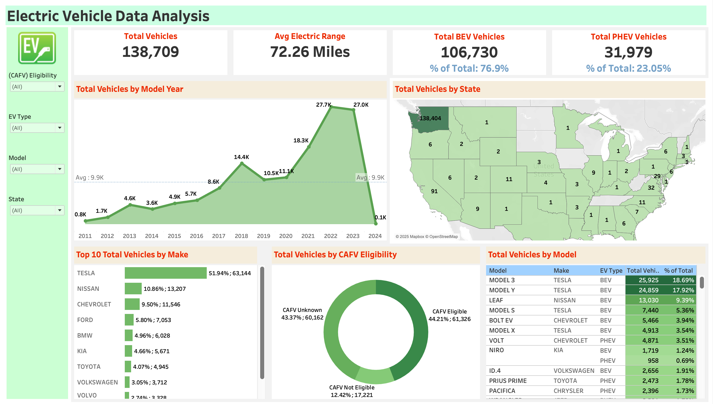
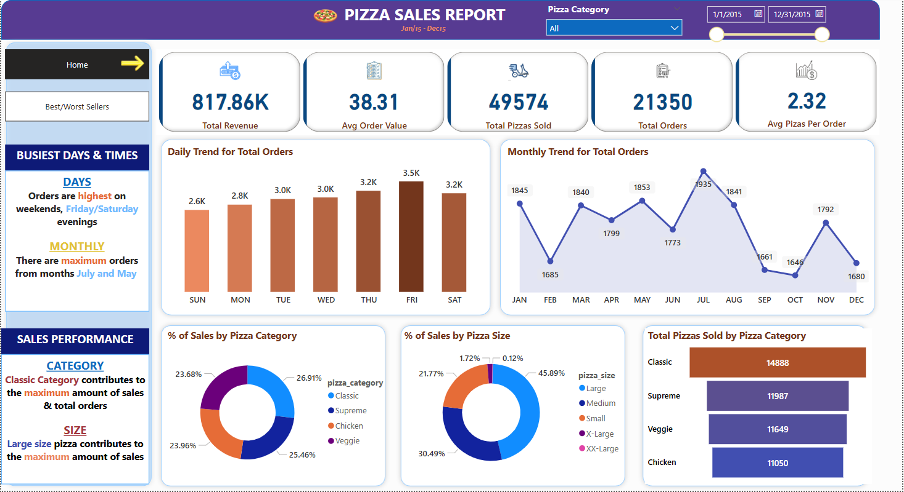
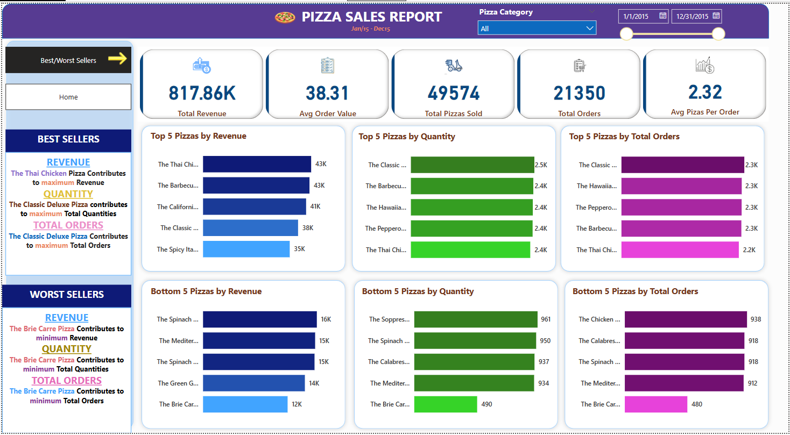

# Nick Norman - Business Intelligence Portfolio
## About

Hi, I'm Nick! I recently graduated in April 2025 with a Bachelor of Management and Organizational Studies from Western University, specializing in Business Intelligence. Through coursework, my role as a Data Analyst Intern at the Better Business Bureau, and running my own service-based startup, I've built a strong foundation in data analytics, dashboard development, and statistical analysis. I am excited to bring my technical and analytical skills to the field of business intelligence as an entry-level BI analyst. 

My work includes data cleaning, statistical analysis, and visualization using tools like Python, SQL, Excel, Tableau, and Power BI. I've built interactive dashboards to support business decisions, automated reporting pipelines, and applied predictive analytics to uncover insights that drive growth. 

In my free time, I enjoy exploring new BI tools, contributing to peer development as a volunteer career advisor, and continously finding ways to connect data with meaningful outcomes. I'm excited to continue developing as a data analyst and business intelligence professional, and to bring my curoisty, grit, and technical skills to impactful, data-driven roles. 

This repository is to showcase my skills, share projects and track my progess in Business Intelligence/Data Analytics related topics. 

## Table of Contents

- [About](#About)

- [Portfolio Projects](#portfolio-projects)

    - Python
        - [EV Analysis](#ev-analysis)
    - SQL
        - [Pizza Sales](#pizza-sales)
    - Tableau
        - [EV Analysis](#ev-analysis)
    - Power BI
        - [Pizza Sales](#pizza-sales)
 
- [Education](#education)

- [Certificates](#certificates)

- [Contact](#contact)

## Portfolio Projects

In this section I highlight my data analytics and business intelligence projects. Each project includes a brief overview of the goal, the tools and skills used, a short description of the process, and key results. 

## EV Analysis

**Code:** [EV_Analysis.ipynb](./EV_Analysis.ipynb)

**Dashboard:** [Click here to download the Tableau dashboard](EV_Analysis_Dashboard.twbx)
*(Right-click the link and select "Save/Download Link As..." if it doesn't download automatically.)*

**Goal:** To analyze electric vehicle registration data in order to uncover trends in EV growth, identify the most common makes and models, evaluate vehicle eligibility for enviormental incentives. 

**Description** This project focused on analyzing a electric vehicle dataset containing over 130,000 entries, including vehicle make, model, range, eligibility status, and registration state. Key steps included data cleaning in Python, exploratory data analysis (EDA), and interactive dashboard development in Tableau. It highlights top EV manufacturers, compares BEV vs. PHEV adoption, maps state-by-state usage, and explores vehicle eligiiblity for Clean Air Vehicle (CAV) incentives. 

**Skills:** Data Cleaning, Data Analysis, EDA, Data Visualization, Interactive Dashboarding, and Filtering.

**Technology:** Python (Pandas, Matplotlib), Tableau, Excel.

**Results:** The final Tableau dashboard presents key insights such as Tesla dominating with over 50% of the EV market, a sharp increase in electric vehicle registrations beginning in 2018, and the dominance of the BEVs (Battery Electric Vehicles). Additionally, the top 10 vehicle models account for the vast majority of all EVs, with the Tesla Model 3 and Model Y leading in adoption. 

## Pizza Sales

**Code:** [Pizza_Sales.sql](Pizza_Sales.sql)

**Dashboard:** [Click here to download the Power BI dashboard](Pizza_Sales_Dashboards.pbix)
*(Right-click the link and select "Save/Download Link As..." if it doesn't download automatically.)*

**Goal:** To analyze pizza sales data in order to uncover top-performing products, highlight sales trends, and support data-driven decision-making for a fictional pizza business.

**Description:** This project focused on analyzing a pizza sales dataset containing over 48,000 entries, including order ID, order date and time, pizza name, category, size, quantity, and total price. Key steps included cleaning the data in SQL Server by adjusting data types, renaming columns for clarity, removing unnecessary fields, and adding new columns such as “Order Hour” to support time-based analysis. Business KPIs were calculated using SQL queries, and the cleaned data was then imported into Power BI for dashboard development. The project resulted in two interactive dashboards: a Sales Overview dashboard highlighting revenue trends, order volume, and category performance; and a Best & Worst Sellers dashboard analyzing product performance across revenue, quantity sold, and number of orders.

**Skills:** Data Cleaning, SQL Querying, KPI Development, Data Visualization, Interactive Dashboarding, and Filtering

**Technology:** SQL, Power BI, Excel

**Results** The final Power BI dashboard presents key insights such as Thai Chicken Pizza generating the highest total revenue, while the Classic Deluxe Pizza leads in both quantity sold and total orders. Medium-sized pizzas were the most frequently purchased, and classic categories contributed the most to overall sales. Additionally, the Brioche Veggie Pizza consistently ranked as the lowest performer across all metrics, highlighting it as a potential candidate for menu optimization.

## Education

University of Western Ontario: Bachelors of BMOS - Business Intelligence, September 2020 - April 2025

## Certificates

While I believe real skills show through projects and hands-on work, these certificates represent my learning journey. They were completed along the way as I deepend my understanding of data tools and techniques: 

- [Google Business Intelligence](https://coursera.org/share/22cefa62273fe181526ee69f755c0485) (July 2023) (Coursera - Google)

## Contacts

- Linkedin: [@NickNorman](https://www.linkedin.com/in/nicknorman1)
- Email: [nicknorman2002@gmail.com](mailto:nicknorman2002@gmail.com)
